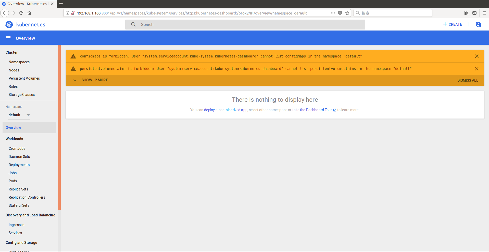
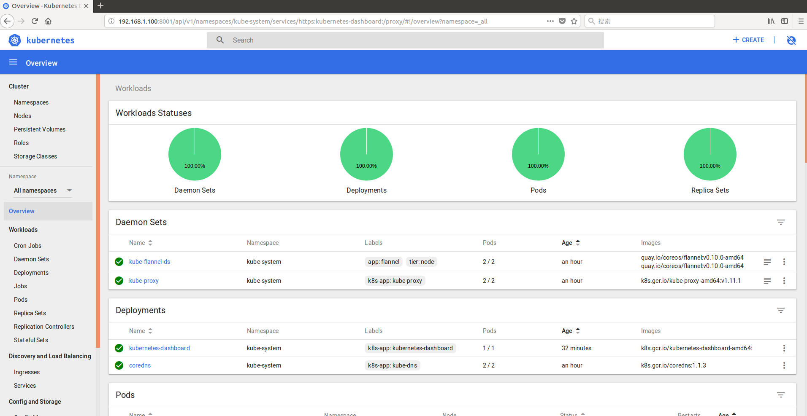
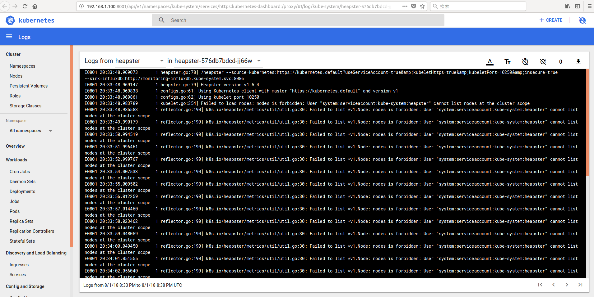
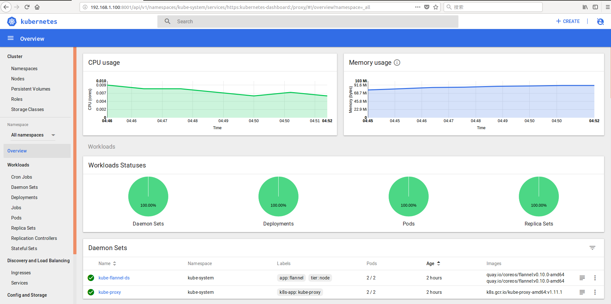
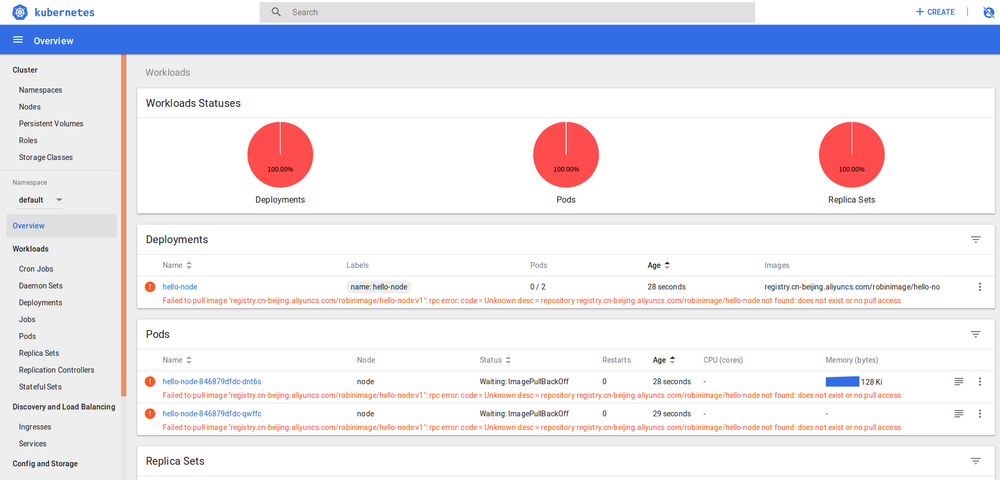
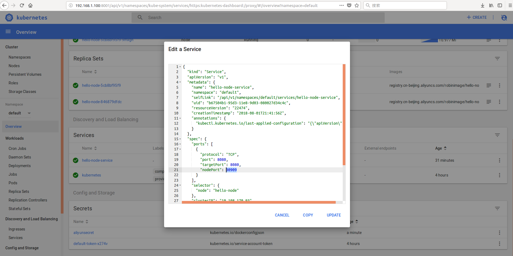
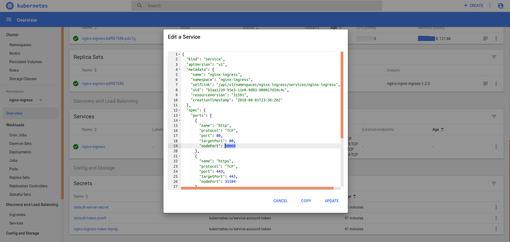

# Kubernetes 1.11.1集群环境搭建及问题解决

## 1. 安装环境
kubernetes(k8s)集群由两个节点组成，master和node节点。使用VirtualBox作为两个节点的宿主机，具体配置如下：
### master节点配置：
- 系统：centos7
- cpu：2核
- 内存：3G
- 硬盘：20G
- 主机名：master
- IP： 192.168.1.100
### node节点配置：
- 系统：centos7
- cpu：2核
- 内存：2G
- 硬盘：20G
- 主机名：node
- IP：192.168.1.101

> 注意：
> 1. master和node节点cpu应该使用双核cpu，单核cpu有可能出现集群启动失败的情况。
> 2. 由于k8s使用主机名标识每个节点，必须为每台主机设置不同的主机名。

## 2. 关闭swap和firewalld
在master和node节点上关闭swap和firewalld(由于node节点命令相同，这里不再列出)。
```
[root@master ~]# swapoff -a
[root@master ~]# systemctl disable firewalld && systemctl stop firewalld
```


## 3. 安装Docker
在master和node节点上分别安装docker，并且启动docker服务。k8s官方文档推荐安装docker ce 17.03或者docker ee 1.11, 1.12, 1.13(由于node节点命令相同，这里不再列出)。
```
[root@master ~]# yum install -y docker
[root@master ~]# systemctl enable docker && systemctl start docker
[root@master ~]# docker version
Client:
 Version:         1.13.1
 API version:     1.26
 Package version: docker-1.13.1-68.gitdded712.el7.centos.x86_64
 Go version:      go1.9.4
 Git commit:      dded712/1.13.1
 Built:           Tue Jul 17 18:34:48 2018
 OS/Arch:         linux/amd64

Server:
 Version:         1.13.1
 API version:     1.26 (minimum version 1.12)
 Package version: docker-1.13.1-68.gitdded712.el7.centos.x86_64
 Go version:      go1.9.4
 Git commit:      dded712/1.13.1
 Built:           Tue Jul 17 18:34:48 2018
 OS/Arch:         linux/amd64
 Experimental:    false
```

## 4. 安装kubeadm, kubelet, kubectl
### 4.1 下载rpm安装包
在master和node节点上分别安装kubeadm, kubelet, kubectl。k8s官网建议使用yum方式安装，通过yum可以自动解决包依赖问题。这里采用下载rpm包的方式进行安装，手动下载rpm包并且上传到master和node节点中。
> 说明：
> 1. 本文中引用的rpm包采用单独下载然后上传到master和node节点的方式。k8s镜像下载采用docker hub作为代理的方式。
> 2. **本文没有在master和node节点中使用代理软件**。

参考k8s官方yum仓库配置， 我们可以在https://packages.cloud.google.com/yum/repos/kubernetes-el7-x86_64/repodata/primary.xml配置文件中找到rpm包的下载链接

需要下载的rpm包：
- cri-tools-1.11.0-0.x86_64.rpm
- kubectl-1.11.1-0.x86_64.rpm
- socat-1.7.3.2-2.el7.x86_64.rpm
- kubelet-1.11.1-0.x86_64.rpm
- kubernetes-cni-0.6.0-0.x86_64.rpm
- kubeadm-1.11.1-0.x86_64.rpm
> 注意: 
> 1. rpm包下载前缀是https://yum.kubernetes.io
> 2. rpm包下载地址类似于https://yum.kubernetes.io/pool/40ff4cf56f1b01f7415f0a4708e190cff5fbf037319c38583c52ae0469c8fcf3-kubeadm-1.11.1-0.x86_64.rpm
> 3. socat-1.7.3.2-2.el7.x86_64.rpm不能在配置文件中找到下载地址，需要google单独下载

### 4.2 安装rpm包
```
[root@master ~]# ls -l *.rpm
-rw-r--r--. 1 root root  4383318 8月   1 22:56 cri-tools-1.11.0-0.x86_64.rpm
-rw-r--r--. 1 root root  7905110 8月   1 22:51 kubeadm-1.11.1-0.x86_64.rpm
-rw-r--r--. 1 root root  7861314 8月   1 22:51 kubectl-1.11.1-0.x86_64.rpm
-rw-r--r--. 1 root root 19012298 8月   1 22:51 kubelet-1.11.1-0.x86_64.rpm
-rw-r--r--. 1 root root  9008838 8月   1 23:00 kubernetes-cni-0.6.0-0.x86_64.rpm
-rw-r--r--. 1 root root   296632 8月   1 23:20 socat-1.7.3.2-2.el7.x86_64.rpm
[root@master ~]# yum install -y ./cri-tools-1.11.0-0.x86_64.rpm 
[root@master ~]# yum install -y ./kubectl-1.11.1-0.x86_64.rpm
[root@master ~]# yum install -y ./socat-1.7.3.2-2.el7.x86_64.rpm
[root@master ~]# yum install -y ./kubelet-1.11.1-0.x86_64.rpm ./kubernetes-cni-0.6.0-0.x86_64.rpm
[root@master ~]# yum install -y ./kubeadm-1.11.1-0.x86_64.rpm
```
> 由于rpm包安装时有依赖关系，注意安装顺序。另外，kubelet-1.11.1-0.x86_64.rpm和kubernetes-cni-0.6.0-0.x86_64.rpm两个包之间相互依赖，所以这两个包需要一起安装。

### 4.3 启动kubelet服务：
```
[root@master ~]# systemctl enable kubelet && systemctl start kubelet
```

### 4.4 修改网络配置：
```
[root@master ~]# cat /etc/sysctl.d/k8s.conf 
net.bridge.bridge-nf-call-ip6tables = 1
net.bridge.bridge-nf-call-iptables = 1
net.ipv4.ip_forward = 1
[root@master ~]# sysctl --system
```

**在node节点安装kubeadm, kubelet, kubectl的命令相同，这里不再列出**

## 5. 初始化master集群
### 5.1 初始化集群
使用kubeadm命令在master节点上初始化集群，由于之后安装pod网络插件的要求，在集群初始化时需要添加--pod-network-cidr=10.244.0.0/16参数
```
[root@master ~]# kubeadm init --pod-network-cidr=10.244.0.0/16
unable to get URL "https://dl.k8s.io/release/stable-1.11.txt": Get https://storage.googleapis.com/kubernetes-release/release/stable-1.11.txt: read tcp 192.168.1.100:38968->216.58.200.48:443: read: connection reset by peer
```
由于master节点无法访问google网络， 集群初始化时无法获得k8s版本号，这里需要手动设置k8s版本号为1.11.1

```
[root@master ~]# kubeadm init --pod-network-cidr=10.244.0.0/16 --kubernetes-version=1.11.1
[init] using Kubernetes version: v1.11.1
[preflight] running pre-flight checks
I0802 01:24:49.412214   26719 kernel_validator.go:81] Validating kernel version
I0802 01:24:49.412364   26719 kernel_validator.go:96] Validating kernel config
[preflight/images] Pulling images required for setting up a Kubernetes cluster
[preflight/images] This might take a minute or two, depending on the speed of your internet connection
[preflight/images] You can also perform this action in beforehand using 'kubeadm config images pull'
[preflight] Some fatal errors occurred:
	[ERROR ImagePull]: failed to pull image [k8s.gcr.io/kube-apiserver-amd64:v1.11.1]: exit status 1
	[ERROR ImagePull]: failed to pull image [k8s.gcr.io/kube-controller-manager-amd64:v1.11.1]: exit status 1
	[ERROR ImagePull]: failed to pull image [k8s.gcr.io/kube-scheduler-amd64:v1.11.1]: exit status 1
	[ERROR ImagePull]: failed to pull image [k8s.gcr.io/kube-proxy-amd64:v1.11.1]: exit status 1
	[ERROR ImagePull]: failed to pull image [k8s.gcr.io/pause:3.1]: exit status 1
	[ERROR ImagePull]: failed to pull image [k8s.gcr.io/etcd-amd64:3.2.18]: exit status 1
	[ERROR ImagePull]: failed to pull image [k8s.gcr.io/coredns:1.1.3]: exit status 1
[preflight] If you know what you are doing, you can make a check non-fatal with `--ignore-preflight-errors=...`
```
### 5.2 拉取镜像
由于无法访问google网络，集群初始化时无法拉取相应的镜像造成初始化失败。
> 说明：
> 1. 本文采用的拉取镜像方法是通过docker hub作为代理先拉取k8s镜像，然后从docker hub拉取镜像到本地，最后把镜像tag成k8s镜像的方式(具体方法可以google这里不再描述)。
> 2. **本文所有k8s镜像的拉取都是通过这种方式完成的**

拉取的镜像列表
- k8s.gcr.io/kube-proxy-amd64:v1.11.1
- k8s.gcr.io/kube-apiserver-amd64:v1.11.1
- k8s.gcr.io/kube-controller-manager-amd64:v1.11.1
- k8s.gcr.io/kube-scheduler-amd64:v1.11.1
- k8s.gcr.io/coredns:1.1.3
- k8s.gcr.io/etcd-amd64:3.2.18
- k8s.gcr.io/pause:3.1
```
[root@master ~]# docker images
REPOSITORY                                                                  TAG                 IMAGE ID            CREATED             SIZE
k8s.gcr.io/kube-proxy-amd64                                                 v1.11.1             d5c25579d0ff        2 weeks ago         97.8 MB
k8s.gcr.io/kube-apiserver-amd64                                             v1.11.1             816332bd9d11        2 weeks ago         187 MB
k8s.gcr.io/kube-controller-manager-amd64                                    v1.11.1             52096ee87d0e        2 weeks ago         155 MB
k8s.gcr.io/kube-scheduler-amd64                                             v1.11.1             272b3a60cd68        2 weeks ago         56.8 MB
k8s.gcr.io/coredns                                                          1.1.3               b3b94275d97c        2 months ago        45.6 MB
k8s.gcr.io/etcd-amd64                                                       3.2.18              b8df3b177be2        3 months ago        219 MB
k8s.gcr.io/pause                                                            3.1                 da86e6ba6ca1        7 months ago        742 kB
```
### 5.3 重新初始化集群：
```
[root@master ~]# kubeadm init --pod-network-cidr=10.244.0.0/16 --kubernetes-version=1.11.1
[init] using Kubernetes version: v1.11.1
[preflight] running pre-flight checks
I0802 02:02:13.821953   29202 kernel_validator.go:81] Validating kernel version
I0802 02:02:13.822045   29202 kernel_validator.go:96] Validating kernel config
[preflight/images] Pulling images required for setting up a Kubernetes cluster
[preflight/images] This might take a minute or two, depending on the speed of your internet connection
[preflight/images] You can also perform this action in beforehand using 'kubeadm config images pull'
[kubelet] Writing kubelet environment file with flags to file "/var/lib/kubelet/kubeadm-flags.env"
[kubelet] Writing kubelet configuration to file "/var/lib/kubelet/config.yaml"
[preflight] Activating the kubelet service
[certificates] Generated ca certificate and key.
[certificates] Generated apiserver certificate and key.
[certificates] apiserver serving cert is signed for DNS names [master kubernetes kubernetes.default kubernetes.default.svc kubernetes.default.svc.cluster.local] and IPs [10.96.0.1 192.168.1.100]
[certificates] Generated apiserver-kubelet-client certificate and key.
[certificates] Generated sa key and public key.
[certificates] Generated front-proxy-ca certificate and key.
[certificates] Generated front-proxy-client certificate and key.
[certificates] Generated etcd/ca certificate and key.
[certificates] Generated etcd/server certificate and key.
[certificates] etcd/server serving cert is signed for DNS names [master localhost] and IPs [127.0.0.1 ::1]
[certificates] Generated etcd/peer certificate and key.
[certificates] etcd/peer serving cert is signed for DNS names [master localhost] and IPs [192.168.1.100 127.0.0.1 ::1]
[certificates] Generated etcd/healthcheck-client certificate and key.
[certificates] Generated apiserver-etcd-client certificate and key.
[certificates] valid certificates and keys now exist in "/etc/kubernetes/pki"
[kubeconfig] Wrote KubeConfig file to disk: "/etc/kubernetes/admin.conf"
[kubeconfig] Wrote KubeConfig file to disk: "/etc/kubernetes/kubelet.conf"
[kubeconfig] Wrote KubeConfig file to disk: "/etc/kubernetes/controller-manager.conf"
[kubeconfig] Wrote KubeConfig file to disk: "/etc/kubernetes/scheduler.conf"
[controlplane] wrote Static Pod manifest for component kube-apiserver to "/etc/kubernetes/manifests/kube-apiserver.yaml"
[controlplane] wrote Static Pod manifest for component kube-controller-manager to "/etc/kubernetes/manifests/kube-controller-manager.yaml"
[controlplane] wrote Static Pod manifest for component kube-scheduler to "/etc/kubernetes/manifests/kube-scheduler.yaml"
[etcd] Wrote Static Pod manifest for a local etcd instance to "/etc/kubernetes/manifests/etcd.yaml"
[init] waiting for the kubelet to boot up the control plane as Static Pods from directory "/etc/kubernetes/manifests" 
[init] this might take a minute or longer if the control plane images have to be pulled
[apiclient] All control plane components are healthy after 42.028068 seconds
[uploadconfig] storing the configuration used in ConfigMap "kubeadm-config" in the "kube-system" Namespace
[kubelet] Creating a ConfigMap "kubelet-config-1.11" in namespace kube-system with the configuration for the kubelets in the cluster
[markmaster] Marking the node master as master by adding the label "node-role.kubernetes.io/master=''"
[markmaster] Marking the node master as master by adding the taints [node-role.kubernetes.io/master:NoSchedule]
[patchnode] Uploading the CRI Socket information "/var/run/dockershim.sock" to the Node API object "master" as an annotation
[bootstraptoken] using token: rlm8dn.tze9ax8xvji7nvgm
[bootstraptoken] configured RBAC rules to allow Node Bootstrap tokens to post CSRs in order for nodes to get long term certificate credentials
[bootstraptoken] configured RBAC rules to allow the csrapprover controller automatically approve CSRs from a Node Bootstrap Token
[bootstraptoken] configured RBAC rules to allow certificate rotation for all node client certificates in the cluster
[bootstraptoken] creating the "cluster-info" ConfigMap in the "kube-public" namespace
[addons] Applied essential addon: CoreDNS
[addons] Applied essential addon: kube-proxy

Your Kubernetes master has initialized successfully!

To start using your cluster, you need to run the following as a regular user:

  mkdir -p $HOME/.kube
  sudo cp -i /etc/kubernetes/admin.conf $HOME/.kube/config
  sudo chown $(id -u):$(id -g) $HOME/.kube/config

You should now deploy a pod network to the cluster.
Run "kubectl apply -f [podnetwork].yaml" with one of the options listed at:
  https://kubernetes.io/docs/concepts/cluster-administration/addons/

You can now join any number of machines by running the following on each node
as root:

  kubeadm join 192.168.1.100:6443 --token rlm8dn.tze9ax8xvji7nvgm --discovery-token-ca-cert-hash sha256:e35df442775dd7c98afcc4ddcf4a5d4c009eff8baea45abe054be931f6db0955
```
> 注意：到这里集群已经初始化完成，这里需要记录一下kubeadm join命令的后续参数，以便于之后的node节点加入集群时使用。

验证集群初始化
```
[root@master ~]# kubectl cluster-info
Kubernetes master is running at https://192.168.1.100:6443
KubeDNS is running at https://192.168.1.100:6443/api/v1/namespaces/kube-system/services/kube-dns:dns/proxy
To further debug and diagnose cluster problems, use 'kubectl cluster-info dump'.

[root@master ~]# kubectl get nodes
NAME      STATUS    ROLES     AGE       VERSION
master    Ready     master    23m       v1.11.1
```
### 5.4 配置kubelet工具
复制/etc/kubernetes/admin.conf文件到~/.kube/config，使得kubelet工具有权限访问集群。
```
[root@master ~]# mkdir .kube
[root@master ~]# cp /etc/kubernetes/admin.conf .kube/config
[root@master ~]# kubelet --version
Kubernetes v1.11.1
```
### 5.5 部署pod网络插件
这里使用Flannel插件。下载flannel部署文件并且上传到master节点
插件部署文件下载地址：
https://raw.githubusercontent.com/coreos/flannel/v0.10.0/Documentation/kube-flannel.yml
```
[root@master ~]# kubectl apply -f ./kube-flannel.yml 
clusterrole.rbac.authorization.k8s.io/flannel created
clusterrolebinding.rbac.authorization.k8s.io/flannel created
serviceaccount/flannel created
configmap/kube-flannel-cfg created
daemonset.extensions/kube-flannel-ds created
```
## 6. node节点加入集群
### 6.1 拉取镜像
在node节点加入集群之前同样需要将k8s镜像拉取到node节点，具体方法与master拉取镜像相同。
```
[root@node ~]# docker images
REPOSITORY                                                                  TAG                 IMAGE ID            CREATED             SIZE
k8s.gcr.io/kube-proxy-amd64                                                 v1.11.1             d5c25579d0ff        2 weeks ago         97.8 MB
k8s.gcr.io/kube-controller-manager-amd64                                    v1.11.1             52096ee87d0e        2 weeks ago         155 MB
k8s.gcr.io/kube-scheduler-amd64                                             v1.11.1             272b3a60cd68        2 weeks ago         56.8 MB
k8s.gcr.io/kube-apiserver-amd64                                             v1.11.1             816332bd9d11        2 weeks ago         187 MB
k8s.gcr.io/coredns                                                          1.1.3               b3b94275d97c        2 months ago        45.6 MB
k8s.gcr.io/etcd-amd64                                                       3.2.18              b8df3b177be2        3 months ago        219 MB
k8s.gcr.io/pause                                                            3.1                 da86e6ba6ca1        7 months ago        742 kB
```
### 6.2 node节点加入集群
使用前面5.3中kubeadm join命令将node节点加入集群。
```
[root@node ~]# kubeadm join 192.168.1.100:6443 --token rlm8dn.tze9ax8xvji7nvgm --discovery-token-ca-cert-hash sha256:e35df442775dd7c98afcc4ddcf4a5d4c009eff8baea45abe054be931f6db0955
[preflight] running pre-flight checks
	[WARNING RequiredIPVSKernelModulesAvailable]: the IPVS proxier will not be used, because the following required kernel modules are not loaded: [ip_vs ip_vs_rr ip_vs_wrr ip_vs_sh] or no builtin kernel ipvs support: map[ip_vs_rr:{} ip_vs_wrr:{} ip_vs_sh:{} nf_conntrack_ipv4:{} ip_vs:{}]
you can solve this problem with following methods:
 1. Run 'modprobe -- ' to load missing kernel modules;
2. Provide the missing builtin kernel ipvs support

I0802 02:57:35.523441   30922 kernel_validator.go:81] Validating kernel version
I0802 02:57:35.523567   30922 kernel_validator.go:96] Validating kernel config
[discovery] Trying to connect to API Server "192.168.1.100:6443"
[discovery] Created cluster-info discovery client, requesting info from "https://192.168.1.100:6443"
[discovery] Requesting info from "https://192.168.1.100:6443" again to validate TLS against the pinned public key
[discovery] Cluster info signature and contents are valid and TLS certificate validates against pinned roots, will use API Server "192.168.1.100:6443"
[discovery] Successfully established connection with API Server "192.168.1.100:6443"
[kubelet] Downloading configuration for the kubelet from the "kubelet-config-1.11" ConfigMap in the kube-system namespace
[kubelet] Writing kubelet configuration to file "/var/lib/kubelet/config.yaml"
[kubelet] Writing kubelet environment file with flags to file "/var/lib/kubelet/kubeadm-flags.env"
[preflight] Activating the kubelet service
[tlsbootstrap] Waiting for the kubelet to perform the TLS Bootstrap...
[patchnode] Uploading the CRI Socket information "/var/run/dockershim.sock" to the Node API object "node" as an annotation

This node has joined the cluster:
* Certificate signing request was sent to master and a response
  was received.
* The Kubelet was informed of the new secure connection details.

Run 'kubectl get nodes' on the master to see this node join the cluster.
```
### 6.3 验证node节点是否加入成功
在master节点上执行：
```
[root@master ~]# kubectl get nodes
NAME      STATUS    ROLES     AGE       VERSION
master    Ready     master    59m       v1.11.1
node      Ready     <none>    15m       v1.11.1
```
> 注意：如果node节点加入失败，可以尝试kubeadm reset，然后重新kubeadm join一次

## 7. 安装Dashboard
### 7.1 下载镜像
由于部署dashboard时需要下载k8s.gcr.io/kubernetes-dashboard-amd64:v1.8.3镜像，通过docker hub代理的方式拉取镜像
```
[root@master ~]# docker images | grep dashboard
k8s.gcr.io/kubernetes-dashboard-amd64                                       v1.8.3              0c60bcf89900        5 months ago        102 MB
```
### 7.2 部署Dashboard
下载dashboard部署文件上传到master节点，部署Dashboard。
部署文件下载地址：
https://raw.githubusercontent.com/kubernetes/dashboard/master/src/deploy/recommended/kubernetes-dashboard.yaml
```
[root@master ~]# kubectl create -f ./kubernetes-dashboard.yaml 
secret/kubernetes-dashboard-certs created
serviceaccount/kubernetes-dashboard created
role.rbac.authorization.k8s.io/kubernetes-dashboard-minimal created
rolebinding.rbac.authorization.k8s.io/kubernetes-dashboard-minimal created
deployment.apps/kubernetes-dashboard created
service/kubernetes-dashboard created

[root@master ~]# kubectl get po --all-namespaces | grep dashboard
kube-system   kubernetes-dashboard-6948bdb78-mzh9q   0/1       ImagePullBackOff   0          3m
```
> 注意：
> 查看Dashboard pod运行状态发现Dashboard运行失败，Dashboard拉取镜像失败。这是因为pod部署时会被分配到node节点上，但是node节点并没有拉取镜像造成的。

在node节点上下载k8s.gcr.io/kubernetes-dashboard-amd64:v1.8.3镜像
```
[root@node ~]# docker images | grep dashboard
k8s.gcr.io/kubernetes-dashboard-amd64                                       v1.8.3              0c60bcf89900        5 months ago        102 MB
```
在master节点上重新部署dashboard:
```
[root@master ~]# kubectl apply -f ./kubernetes-dashboard.yaml 
Warning: kubectl apply should be used on resource created by either kubectl create --save-config or kubectl apply
secret/kubernetes-dashboard-certs configured
Warning: kubectl apply should be used on resource created by either kubectl create --save-config or kubectl apply
serviceaccount/kubernetes-dashboard configured
Warning: kubectl apply should be used on resource created by either kubectl create --save-config or kubectl apply
role.rbac.authorization.k8s.io/kubernetes-dashboard-minimal configured
Warning: kubectl apply should be used on resource created by either kubectl create --save-config or kubectl apply
rolebinding.rbac.authorization.k8s.io/kubernetes-dashboard-minimal configured
Warning: kubectl apply should be used on resource created by either kubectl create --save-config or kubectl apply
deployment.apps/kubernetes-dashboard configured
Warning: kubectl apply should be used on resource created by either kubectl create --save-config or kubectl apply
service/kubernetes-dashboard configured

[root@master ~]# kubectl get po --all-namespaces | grep dashboard
kube-system   kubernetes-dashboard-6948bdb78-mzh9q   1/1       Running   0          11m
```
### 7.3 访问Dashboard
Dashboard部署成功，我们通过kubectl proxy的方式来访问Dashboard。
> 注意：由于默认kubectl proxy命令只能在master本机访问Dashboard，如果想在其他机器上访问Dashboard需要添加代理参数：
```
[root@master ~]# kubectl  proxy --address=0.0.0.0 --accept-hosts=^*$ &
[1] 28415
[root@master ~]# Starting to serve on [::]:8001
```
代理启动成功，现在可以在任何机器上访问Dashboard。进入登录页面点击skip进入dashboard主页面。
Dashboard登录地址：
http://192.168.1.100:8001/api/v1/namespaces/kube-system/services/https:kubernetes-dashboard:/proxy/#!/overview?namespace=default


> 说明：因为跳过了登录页面，由于权限问题目前无法看到任何内容

### 7.4 授权Dashboard账户
授权dashboard service账户，首先创建dashboard-admin.yaml文件(文件内容如下)，然后部署dashboard-admin.yaml
参考文档：https://github.com/kubernetes/dashboard/wiki/Access-control
```
[root@master ~]# cat dashboard-admin.yaml 
apiVersion: rbac.authorization.k8s.io/v1beta1
kind: ClusterRoleBinding
metadata:
  name: kubernetes-dashboard
  labels:
    k8s-app: kubernetes-dashboard
roleRef:
  apiGroup: rbac.authorization.k8s.io
  kind: ClusterRole
  name: cluster-admin
subjects:
- kind: ServiceAccount
  name: kubernetes-dashboard
  namespace: kube-system
[root@master ~]# kubectl create -f ./dashboard-admin.yaml 
clusterrolebinding.rbac.authorization.k8s.io/kubernetes-dashboard created
```
现在跳过登录页面后已经可以正常访问dashboard页面了：


### 7.5 安装Heapster插件 
为了能在Dashboard中查看节点状态，需要安装Dashboard Heapster插件
文档参考：https://github.com/kubernetes/heapster/blob/master/docs/influxdb.md

这里需要下载几个Heapster部署文件，grafana.yaml，heapster.yaml，influxdb.yaml，heapster-rbac.yaml
下载地址：
https://github.com/kubernetes/heapster/tree/master/deploy/kube-config/influxdb
https://github.com/kubernetes/heapster/tree/master/deploy/kube-config/rbac

使用docker hub代理的方式下载Heapster部署文件中用到的镜像。同理，也在node节点上下载相应的镜像
- k8s.gcr.io/heapster-amd64:v1.5.4
- k8s.gcr.io/heapster-influxdb-amd64:v1.5.2
- k8s.gcr.io/heapster-grafana-amd64:v5.0.4
```
[root@master heapster]# docker images
REPOSITORY                                                                  TAG                 IMAGE ID            CREATED             SIZE
k8s.gcr.io/heapster-amd64                                                   v1.5.4              72d68eecf40c        6 days ago          75.3 MB
k8s.gcr.io/heapster-influxdb-amd64                                          v1.5.2              eb180058aee0        7 days ago          16.5 MB
k8s.gcr.io/heapster-grafana-amd64                                           v5.0.4              25e1da333f76        7 days ago          171 MB
k8s.gcr.io/kube-proxy-amd64                                                 v1.11.1             d5c25579d0ff        2 weeks ago         97.8 MB
k8s.gcr.io/kube-controller-manager-amd64                                    v1.11.1             52096ee87d0e        2 weeks ago         155 MB
k8s.gcr.io/kube-scheduler-amd64                                             v1.11.1             272b3a60cd68        2 weeks ago         56.8 MB
k8s.gcr.io/kube-apiserver-amd64                                             v1.11.1             816332bd9d11        2 weeks ago         187 MB
k8s.gcr.io/coredns                                                          1.1.3               b3b94275d97c        2 months ago        45.6 MB
k8s.gcr.io/etcd-amd64                                                       3.2.18              b8df3b177be2        3 months ago        219 MB
k8s.gcr.io/kubernetes-dashboard-amd64                                       v1.8.3              0c60bcf89900        5 months ago        102 MB
quay.io/coreos/flannel                                                      v0.10.0-amd64       f0fad859c909        6 months ago        44.6 MB
k8s.gcr.io/pause                                                            3.1                 da86e6ba6ca1        7 months ago        742 kB
```
> **注意：**
> **由于k8s在1.11.1版本中默认关闭了read only 10255端口，在部署Heapster之前需要修改heapster.yaml部署文件，增加参数?useServiceAccount=true&kubeletHttps=true&kubeletPort=10250&insecure=true**
```
[root@master heapster]# cat heapster.yaml 
apiVersion: v1
kind: ServiceAccount
metadata:
  name: heapster
  namespace: kube-system
---
apiVersion: extensions/v1beta1
kind: Deployment
metadata:
  name: heapster
  namespace: kube-system
spec:
  replicas: 1
  template:
    metadata:
      labels:
        task: monitoring
        k8s-app: heapster
    spec:
      serviceAccountName: heapster
      containers:
      - name: heapster
        image: k8s.gcr.io/heapster-amd64:v1.5.4
        imagePullPolicy: IfNotPresent
        command:
        - /heapster
        - --source=kubernetes:https://kubernetes.default?useServiceAccount=true&kubeletHttps=true&kubeletPort=10250&insecure=true
        - --sink=influxdb:http://monitoring-influxdb.kube-system.svc:8086
---
apiVersion: v1
kind: Service
metadata:
  labels:
    task: monitoring
    # For use as a Cluster add-on (https://github.com/kubernetes/kubernetes/tree/master/cluster/addons)
    # If you are NOT using this as an addon, you should comment out this line.
    kubernetes.io/cluster-service: 'true'
    kubernetes.io/name: Heapster
  name: heapster
  namespace: kube-system
spec:
  ports:
  - port: 80
    targetPort: 8082
  selector:
    k8s-app: heapster
```

部署Heapster插件：
```
[root@master heapster]# kubectl create -f ./grafana.yaml 
deployment.extensions/monitoring-grafana created
service/monitoring-grafana created

[root@master heapster]# kubectl create -f ./heapster.yaml 
serviceaccount/heapster created
deployment.extensions/heapster created
service/heapster created

[root@master heapster]# kubectl create -f ./influxdb.yaml 
deployment.extensions/monitoring-influxdb created
service/monitoring-influxdb created

[root@master heapster]# kubectl create -f ./heapster
heapster-rbac.yaml  heapster.yaml 
      
[root@master heapster]# kubectl create -f ./heapster-rbac.yaml 
clusterrolebinding.rbac.authorization.k8s.io/heapster created
```
Heapster部署成功但是没有正常显示监控数据，查看Heapster pod日志，发现是由于缺少权限造成的。


执行kubectl -n kube-system edit clusterrole system:heapster命令修改clusterrole，为Heapster增加权限：
```
[root@master heapster]# kubectl -n kube-system edit clusterrole system:heapster
需要增加部分：
- apiGroups:
  - ""
  resources:
  - nodes/stats
  verbs:
  - create
```
Heapster监控启动成功：


## 8. 部署hello-node测试程序
### 8.1 创建server.js测试程序
创建一个server.js程序，这个程序启动8080端口输出Hello World，程序用nodejs运行
> 说明： 这里的测试程序镜像生成是在另一台主机完成的。
```
robin@robin-machine:~/Tmp$ cat server.js 
var http = require('http');

var handleRequest = function(request, response) {
  console.log('Received request for URL: ' + request.url);
  response.writeHead(200);
  response.end('Hello World!');
};
var www = http.createServer(handleRequest);
www.listen(8080);
robin@robin-machine:~/Tmp$ node server.js &

robin@robin-machine:~$ curl http://localhost:8080
Hello World!
```
### 8.2 生成镜像
使用docker build命令生成hello-node镜像，并且将镜像上传到阿里云：
```
robin@robin-machine:~/Tmp$ cat Dockerfile 
FROM node:6.9.2
EXPOSE 8080
COPY server.js .
CMD node server.js
robin@robin-machine:~/Tmp$ docker build -t hello-node:v1 .
robin@robin-machine:~/Tmp$ docker tag hello-node:v1 registry.cn-beijing.aliyuncs.com/robinimage/hello-node:v1
robin@robin-machine:~/Tmp$ docker push registry.cn-beijing.aliyuncs.com/robinimage/hello-node:v1
```
> 注意： 镜像上传阿里云之前需要先docker login登录阿里云

### 8.3 部署hello-node应用
登录master节点，创建hello-node部署文件
```
[root@master ~]# cat ./hello-node.yaml 
apiVersion: apps/v1beta1
kind: Deployment
metadata:
  name: hello-node
  labels:
    name: hello-node
spec:
  replicas: 2
  template:
    metadata:
      labels:
        node: hello-node
    spec:
      containers:
      - name: hello-node
        image: registry.cn-beijing.aliyuncs.com/robinimage/hello-node:v1
        ports:
        - containerPort: 8080
---
kind: Service
apiVersion: v1
metadata:
  name: hello-node-service
spec:
  selector:
    node: hello-node
  ports:
    - port: 8080
      targetPort: 8080
  type: NodePort

[root@master ~]# kubectl apply -f ./hello-node.yaml 
deployment.apps/hello-node created
service/hello-node-service created
```
通过查看Dashboard发现，hello-node部署失败

> 说明：由于hello-node:v1这个镜像在阿里云上是一个私有镜像，k8s没有权限拉取私有镜像，所以这里部署失败

### 8.4 创建secret，拉取私有镜像
如果想拉取私有镜像需要创建secret， 这里需要根据自己的阿里云仓库设置服务器，用户名，密码
```
[root@master ~]# kubectl create secret docker-registry aliyunsecret --docker-server=DOCKER_REGISTRY_SERVER --docker-username=DOCKER_USER --docker-password=DOCKER_PASSWORD
secret/aliyunsecret created
```

### 8.5 更新部署文件，重新部署hello-node应用
更新hello-node.yaml部署文件，加入imagePullSecrets字段引用前面创建的aliyunsecret，然后重新部署应用。
```
[root@master ~]# cat hello-node.yaml 
apiVersion: apps/v1beta1
kind: Deployment
metadata:
  name: hello-node
  labels:
    name: hello-node
spec:
  replicas: 2
  template:
    metadata:
      labels:
        node: hello-node
    spec:
      containers:
      - name: hello-node
        image: registry.cn-beijing.aliyuncs.com/robinimage/hello-node:v1
        ports:
        - containerPort: 8080
      imagePullSecrets:
      - name: aliyunsecret
---
kind: Service
apiVersion: v1
metadata:
  name: hello-node-service
spec:
  selector:
    node: hello-node
  ports:
    - port: 8080
      targetPort: 8080
  type: NodePort

[root@master ~]# kubectl apply -f ./hello-node.yaml 
deployment.apps/hello-node configured
service/hello-node-service unchanged
```
### 8.6 验证hello-node服务
到这里hello-node服务已经部署成功，由于hello-node服务使用nodePort类型，查看service配置文件的nodePort端口(该端口是k8s自动分配，用于通过node节点访问服务)


验证服务：
```
[root@master ~]# curl http://192.168.1.101:30909
Hello World!
```

### 8.7 配置ingress, ingress controller
1. 由于nodePort类型服务是通过在节点上开通端口来对外提供服务的，如果想通过域名+url的方式访问服务需要配置ingress
> 注意：由于ingress gce安装后会出现健康检查不通过，造成ingress controller服务启动失败的问题。这里选用的是nginx ingress


2. 安装nginx ingress controller

由于nginx ingress controller需要使用nginx/nginx-ingress镜像， 在master和node节点上分别拉取镜像(docker hub镜像可以直接拉取)
```
[root@master ~]# docker images | grep nginx
docker.io/nginx/nginx-ingress                                               latest              055ef96492c1        3 months ago        135 MB
```

3. 下载nginx ingress部署文件，并且上传到master节点
- common/ns-and-sa.yaml
- common/default-server-secret.yaml
- rbac/rbac.yaml
- deployment/nginx-ingress.yaml
- service/nodeport.yaml

安装文档参考：
https://github.com/nginxinc/kubernetes-ingress/blob/master/docs/installation.md

4. 部署nginx ingress
```
[root@master nginx controller]# ls
default-server-secret.yaml  nginx-ingress.yaml  nodeport.yaml  ns-and-sa.yaml  rbac.yaml
[root@master nginx controller]# kubectl apply -f ./ns-and-sa.yaml 
namespace/nginx-ingress created
serviceaccount/nginx-ingress created
[root@master nginx controller]# kubectl apply -f ./default-server-secret.yaml 
secret/default-server-secret created
[root@master nginx controller]# kubectl apply -f ./rbac.yaml 
clusterrole.rbac.authorization.k8s.io/nginx-ingress created
clusterrolebinding.rbac.authorization.k8s.io/nginx-ingress created
[root@master nginx controller]# kubectl apply -f ./nginx-ingress.yaml 
deployment.extensions/nginx-ingress created
[root@master nginx controller]# kubectl create -f ./nodeport.yaml 
service/nginx-ingress created
```

### 8.8 更新hello-node部署文件，配置ingress

更新hello-node.yaml部署文件，增加ingress配置，并且重新部署
```
[root@master ~]# cat hello-node.yaml 
apiVersion: apps/v1beta1
kind: Deployment
metadata:
  name: hello-node
  labels:
    name: hello-node
spec:
  replicas: 2
  template:
    metadata:
      labels:
        node: hello-node
    spec:
      containers:
      - name: hello-node
        image: registry.cn-beijing.aliyuncs.com/robinimage/hello-node:v1
        ports:
        - containerPort: 8080
      imagePullSecrets:
      - name: aliyunsecret
---
kind: Service
apiVersion: v1
metadata:
  name: hello-node-service
spec:
  selector:
    node: hello-node
  ports:
    - port: 8080
      targetPort: 8080
  type: NodePort
---
apiVersion: extensions/v1beta1
kind: Ingress
metadata:
  name: hello-node
  annotations:
    nginx.ingress.kubernetes.io/rewrite-target: /
spec:
  rules:
  - host: robin.k8s.com.cn
    http:
      paths:
      - path: /hello-node
        backend:
          serviceName: hello-node-service
          servicePort: 8080

[root@master ~]# kubectl apply -f ./hello-node.yaml 
deployment.apps/hello-node unchanged
service/hello-node-service unchanged
ingress.extensions/hello-node created
```

### 8.9 验证ingress访问结果
通过Dashboard查看nginx-ingress服务的nodePort端口为30069



验证ingress访问结果：
```
[root@master ~]# curl --resolve robin.k8s.com.cn:30069:192.168.1.101 http://robin.k8s.com.cn:30069/hello-node
Hello World!
```
> 注意： ingress的访问必须通过域名的方式，30069为nginx-ingress服务nodePort端口

